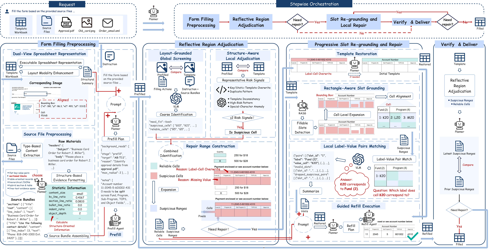
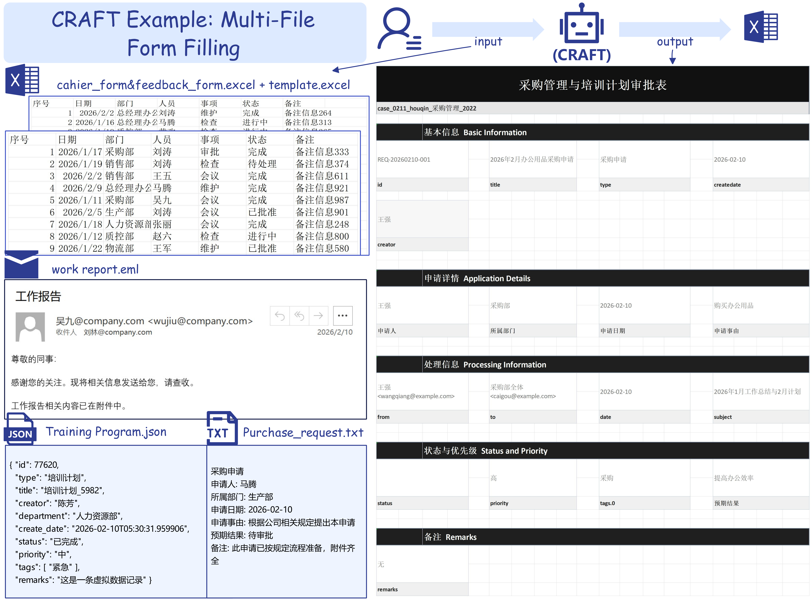
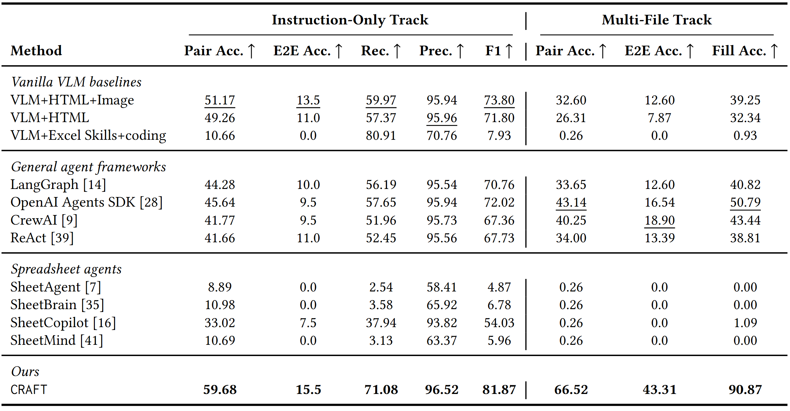
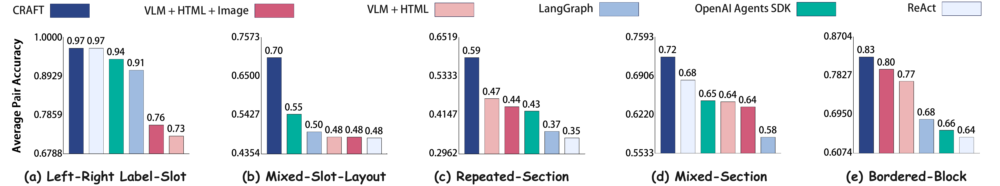

# CRAFT

## Project Overview

**CRAFT** is a standalone spreadsheet-form filling pipeline extracted from the larger project codebase and repackaged as an independent repository.

It focuses on a practical workflow:
- convert the input file into a pipeline-friendly workbook
- render the sheet into a visual form representation
- detect writable regions with a local vision model
- use an external agent/VLM to map source evidence into the correct spreadsheet fields
- run reflection and local repair passes before producing the final workbook

Compared with the original mixed codebase, this repository is designed to be easier to run, configure, and hand off.

## Core Features

- **Self-contained pipeline packaging** with a normal `src/` Python layout and a stable compatibility entrypoint at `my-pipeline.py`.
- **Source-aware filling** that can consume Excel, PDF, DOCX, images, and manifests as filling evidence.
- **Structure + vision hybrid execution** where local visual preprocessing and slot detection are combined with remote model reasoning.
- **Agentic repair loop** with verification, regional repair, and template-aware restoration.
- **Config-driven deployment** through a local `config.yaml`, initialized from `config.example.yaml`, so model name, base URL, and API key do not need to be repeated on every command.

## System Architecture

Following the paper, CRAFT is organized around three main modules coordinated by an agent-based planner:

**Form Filling Preprocessing** (template form + source files -> initial prefilled form)

- Normalizes heterogeneous auxiliary files into structured multi-file evidence representations.
- Builds a **Dual-View Spreadsheet Representation**:
  executable spreadsheet representation for direct spreadsheet manipulation, plus a layout-aligned visual view for later reflection.
- Performs **Source File Preprocessing**:
  type-based content extraction, structure-based evidence formatting, and source bundle assembling.
- Runs **Planner-Guided Prefilling**:
  first generates a structure-based filling plan, then executes a plan-guided prefill pass over the canonical workbook.

**Reflective Region Adjudication** (prefilled form -> suspicious ranges + protected cells)

- Performs evidence-grounded filling validation over the current workbook state.
- Uses a two-stage adjudication pipeline:
  **Stage 1: Layout-Grounded Global Screening** to identify reliable and suspicious cells from aligned template/form views.
- Uses **Stage 2: Structure-Aware Local Adjudication** to diagnose spreadsheet-specific risk signals such as label-cell overwrite, semantic ambiguity, template inconsistency, and label-value layout abnormality.
- Consolidates cell-level findings into compact repair targets through **Repair Range Construction**.

**Progressive Slot Re-grounding and Repair** (suspicious ranges -> corrected final form)

- Restores overwritten local template content when necessary through **Template Restoration**.
- Re-grounds writable slots inside suspicious regions using the **Rectangle-Aware Slot Grounder (RASG)**.
- Converts grounded slot candidates into local refill hints through **Local Label-Value Matching**.
- Applies **Guided Refill Execution** to perform constrained local rewriting while preserving reliable cells and protected context.

## Architecture Figure

<p align="center">
  
</p>

## Installation Guide

1. **Clone the repository**

```bash
git clone https://anonymous.4open.science/r/CRAFT-5715 CRAFT
```

2. **Enter the repository**

```bash
cd ./CRAFT
```

3. **Install the base dependencies**

```bash
python -m pip install -r requirements.txt
```

4. **Install the local vision / ML dependencies**

```bash
python -m pip install -r requirements-ml.txt
```

5. **Create a local config file**

```bash
cp ./config.example.yaml ./config.yaml
```

## Configuration

`config.example.yaml` is the tracked template. Copy it to `config.yaml` for local use. Command-line arguments override the local config file.

Example:

```yaml
agent:
  model: gemini-3-1-flash-lite-preview
  base_url: https://api.example.com/v1
  api_key: your-api-key

planner:
  model: ""
  base_url: ""
  api_key: ""
```

Typical values you may want to keep in `config.yaml`:
- `agent.model`
- `agent.base_url`
- `agent.api_key`
- `planner.model`
- `planner.base_url`
- `planner.api_key`

Initialize the local config file with:

```bash
cp ./config.example.yaml ./config.yaml
```

The default local config path is:

```text
CRAFT/config.yaml
```

You can also pass another config file explicitly:

```bash
python ./my-pipeline.py --config ./config.yaml --input ./input.xlsx --output ./filled.xlsx
```

## Usage Examples

Shortest practical command:

```bash
python ./my-pipeline.py \
  --input "/path/to/input.xlsx" \
  --source_file "/path/to/source1.pdf" \
  --output "/path/to/output.xlsx" \
  --agent_model "<your_model>"
```

If `agent.model`, `agent.base_url`, and `agent.api_key` are already in `config.yaml`, the command becomes:

```bash
python ./my-pipeline.py \
  --input "/path/to/input.xlsx" \
  --source_file "/path/to/source1.pdf" \
  --output "/path/to/output.xlsx"
```

Example with multiple sources:

```bash
python ./my-pipeline.py \
  --input "/path/to/input.xlsx" \
  --source_file "/path/to/source1.pdf" \
  --source_file "/path/to/source2.docx" \
  --output "/path/to/output.xlsx"
```

## Dependency Notes

`requirements.txt` contains the base runtime dependencies:
- OpenAI-compatible API client
- Excel / DOCX / PDF parsing
- HTML / YAML helpers
- platform integration helpers

`requirements-ml.txt` contains the local heavy dependencies:
- `numpy`
- `opencv-python`
- `torch`
- `transformers`
- `peft`
- `paddleocr`

For the current pipeline, both files are usually needed because slot detection still depends on local vision inference.

## Examples

This section shows representative qualitative examples from CRAFT. Each example illustrates how the pipeline interprets natural-language or multi-file evidence, grounds the evidence to spreadsheet regions, and fills the target workbook while preserving the original form layout.

### Multilingual Spreadsheet Form Filling

<p align="center">
  
</p>

[Open the multilingual example PDF](docs/figures/examplephoto1.pdf)

This example highlights CRAFT's ability to fill forms across different languages and form conventions. The inputs include Chinese, English, and Hungarian task descriptions, while the target spreadsheets use different field names, table structures, and formatting styles. CRAFT extracts the relevant entities, dates, contact information, approval fields, and free-text details from the source descriptions, then maps them into the correct spreadsheet cells without relying on a fixed language-specific schema.

### Different Label-Value Layouts

<p align="center">
  
</p>

[Open the label-value layout example PDF](docs/figures/examplephoto2.pdf)

This example demonstrates form filling under varied label-value layouts. The three forms use different visual structures: compact reimbursement sections, two-column vehicle request fields, and a larger training enrollment form with grouped approval blocks. CRAFT uses the spreadsheet structure together with the rendered layout to identify writable regions, associate each label with its intended value cell, and avoid overwriting section headers or static template text.

### Multi-File Form Filling

<p align="center">
  
</p>

[Open the multi-file example PDF](docs/figures/examplephoto3.pdf)

This example shows CRAFT filling a procurement and training approval form from a bundle of heterogeneous source files. The source evidence includes Excel files, an email-style work report, a JSON training record, and a text purchase request. CRAFT consolidates these files into a single evidence bundle, resolves overlapping or complementary fields, and writes the selected information into the final spreadsheet form across basic information, application details, processing information, status, priority, and remarks sections.

## Experimental Results

We compare CRAFT on benchmark tasks using the paper assets currently included in this repository.

Main benchmark table on the Instruction-Only and Multi-File tracks:

<p align="center">
  
</p>

<p align="center">
  
</p>

## Project Structure

```text
CRAFT/
|-- my-pipeline.py
|-- config.example.yaml
|-- LICENSE
|-- requirements.txt
|-- requirements-ml.txt
|-- pyproject.toml
|-- agent_skills/
|   |-- README.md
|   `-- skills.txt
|-- docs/
|   |-- examples/
|   |   `-- README.md
|   |-- figures/
|   |   `-- README.md
|   `-- results/
|       |-- README.md
|       `-- tables/
|           `-- README.md
`-- src/
    `-- craft/
        |-- pipeline_agent_runner.py
        |-- pipeline_agent_actions.py
        |-- pipeline_agent_planner.py
        |-- pipeline_agent_types.py
        |-- pipeline_input_adapter.py
        |-- pipeline_source_adapter.py
        |-- my_pipeline_legacy.py
        |-- reflect_plugin.py
        |-- runtime/
        |-- convert/
        `-- vision/
```

## Core Process

1. **Form Filling Preprocessing**: construct the dual-view spreadsheet representation, preprocess heterogeneous source files, assemble the source bundle, and generate an initial planner-guided prefill.
2. **Reflective Region Adjudication**: run layout-grounded global screening and structure-aware local adjudication to isolate suspicious cells, reliable cells, and repair ranges.
3. **Repair Range Construction**: merge and expand suspicious cells into compact local repair targets that preserve surrounding layout context.
4. **Progressive Slot Re-grounding**: restore template content when needed and use RASG to recover plausible writable slots inside each suspicious region.
5. **Local Label-Value Matching and Guided Refill**: convert slot candidates into positive and negative refill hints, then execute constrained local repair actions.
6. **Verify and Deliver**: repeat the adjudication and repair loop until no high-risk structural ranges remain, then save the final workbook and runtime artifacts.

## Notes

- The default local checkpoint path is `src/craft/vision/best_segformer.pt`.
- `agent_skills_file` defaults to `CRAFT/agent_skills/skills.txt`.
- Copy `config.example.yaml` to a local `config.yaml` before storing API keys.
- `config.yaml` is ignored by git by default, so local API keys can stay uncommitted.
- Parts of the workbook and render path still rely on platform-specific integrations, so environment compatibility should be validated before deployment.

## License

This project is released under the [MIT License](LICENSE).
